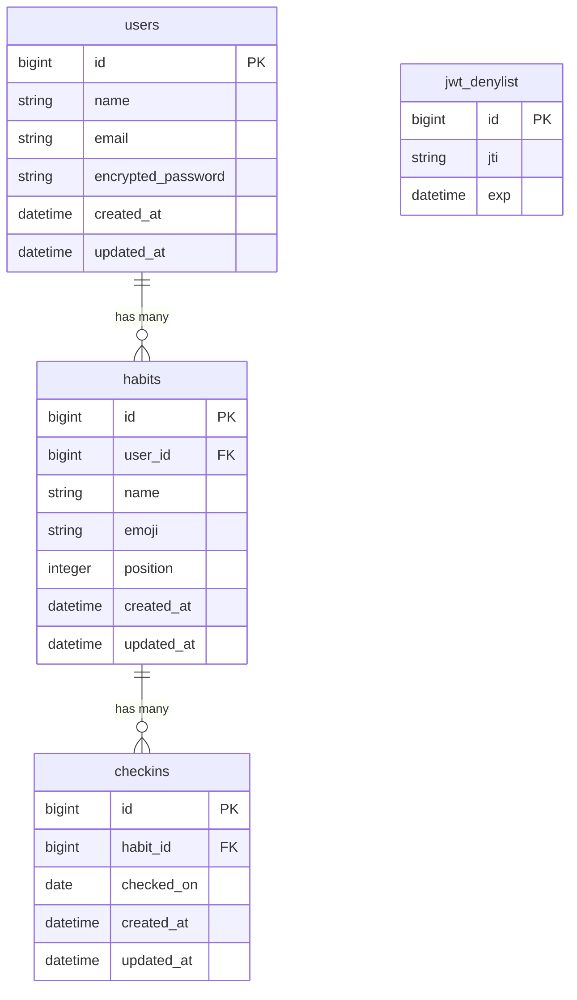

# Habit Tracker

## アプリの概要

毎日の習慣を記録・可視化するミニマルな習慣トラッカーアプリ。習慣のチェックオフ・ストリーク管理・週間グリッドによる振り返りができる。

---

## アプリのスクショ

> ※スクリーンショットをここに追加してください

---

## アプリの使い方

1. **アカウント登録 / ログイン**  
   メールアドレスとパスワードでアカウントを作成してログイン

2. **習慣の追加**  
   ホーム画面の「+」ボタンから習慣名と絵文字を設定して追加

3. **チェックオフ**  
   習慣カードをタップして今日の達成を記録

4. **週間グリッドで振り返り**  
   各習慣カードに過去7日間の達成状況がグリッド表示される

5. **マイページ**  
   プロフィールの表示・編集ができる

---

## なぜこれを作ったか

日々の習慣を継続するためのシンプルなツールが欲しかったため。既存アプリは機能過多なものが多く、毎日気軽にチェックできるミニマルな設計を目指して開発した。また、Rails API × React という構成でフルスタック開発の経験を積む目的もあった。

---

## 工夫したところ

- **ストリーク計算をサーバーサイドで実装**  
  前日にチェックがあれば継続、なければ当日から再カウントするロジックをRailsモデルに集約し、タイムゾーン（JST）を考慮した正確な計算を実現

- **JWTによるステートレス認証**  
  devise + devise-jwt を組み合わせ、Rails API modeでセッション不使用のトークン認証を実装。ログアウト時はDenylistでトークンを無効化

- **週間グリッドのUI**  
  今日を右端として過去7日間を動的に生成し、チェック済みの日を視覚的に表示

- **モバイルファーストのレイアウト**  
  Tailwind CSSで自作コンポーネントのみを使用し、ライブラリに依存しないUIを構築

---

## ER図

---

## 技術スタック

| 種別 | 技術 |
|------|------|
| バックエンド | Ruby 3.3.3 / Rails 7.2 (API mode) |
| フロントエンド | React 18 / TypeScript / Vite / Tailwind CSS |
| データベース | PostgreSQL 14 |
| 認証 | devise + devise-jwt |
| デプロイ | Heroku |

---

## デプロイ先

https://habit-tracker-frontend-prod-7c48728fa5d5.herokuapp.com

